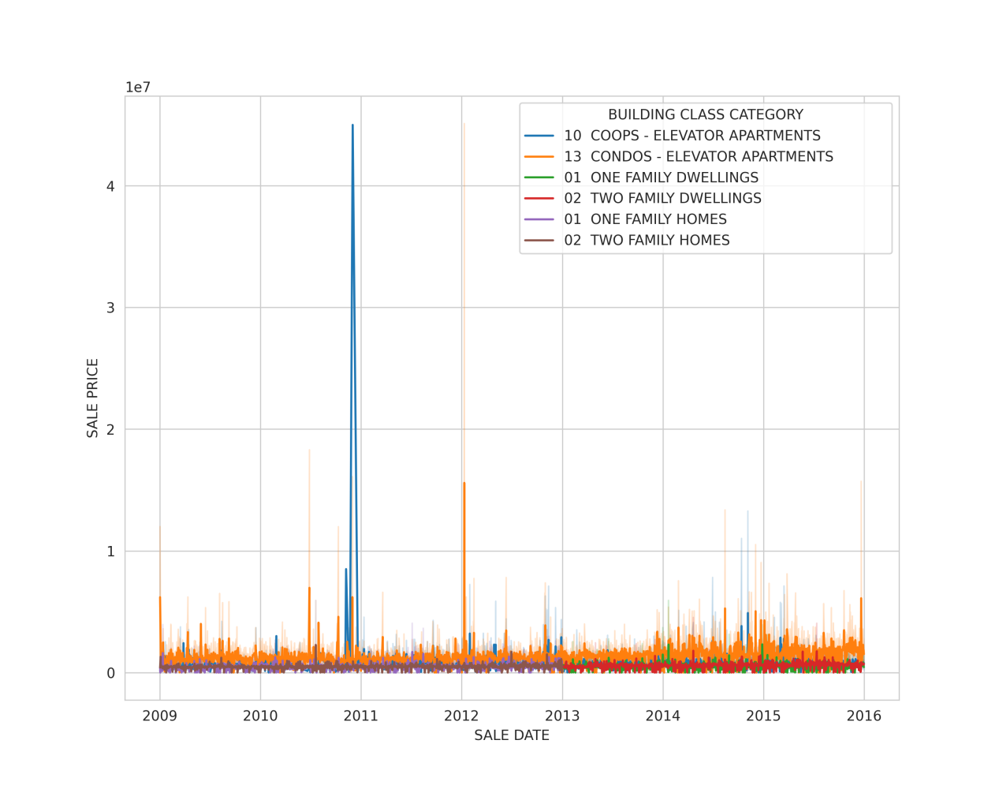

# Report

## Brief introduction

### The goal of our data mining final project

Our project aims to find out an important factor that affects the price of housing. Therefore, we collected the data on shooting incidents as an indicator of violent crime and information on housing sales in New York to find out their relationship.

The goal is to determine the relationship between change in crime rate and change in housing prices in New York City. We hypothesize that a change in the crime rate has a lingering effect, and we would like to verify this hypothesis.

### Target audience of the project

We believe real estate agents would be interested in the result of this data mining project since they could speculate on the price if they know the relationship between price and crime rate. Besides, the local government may also care about the link between the price of housing and the crime rate to make an effort to control the crime rate, such as strengthening the police force if necessary for economic policies

### Main idea

We would expect that the type of housing will affect its price. For example, a single-detached home is probably more expensive than an apartment.

The main idea is to use shooting incidents as an indicator of violent crime and predict changes in real sale price (i.e., adjusted by CPI). Then, we would build a linear model on the predictors(building type, borough, prev year neighborhood crimes, prev*2 year neighborhood crimes, ...) to predict the real sale price. And where:

- Building type is the building class category specified by NYC calendar sales. It becomes one-hot encoded.

* Borough also becomes one-hot encoded.
* Neighbourhood crime rate is obtained by the total number of shooting incidents in a zip code region.
* Real sale price is obtained by sale price/CPI * 100

### Modeling method

We constructed the models and predictions using least squares regression(OLS). The model finds the best function match for the data by minimizing the sum of squares of the error. We can use the statistical test of the coefficient of the model to verify whether the variable is significant so that the important factors which affect the price of housing can be easily found by the T-test. Besides, This OLS model can also help us predict house prices.

## Data mining

We need to get valuable data from messy and different data sets and process them to make high-quality data conducive to research. The research idea is shown in the following flow chart:

			
    
	
    
     	
    Figure1: Research Idea	
    

To achieve all above, We have followed the following steps:

(1) **Get the data we need from different datasets.**
We have collected a large number of data sets, including housing prices and regional information in different urban years, specific crimes of shootings, occur time, CPI values in different years, block postcode, etc. We extracted the data information to be used and classified the corresponding data mining methods, such as data processing, to make the messy data set an effective data for subsequent research and analysis.

(2) **Data cleaning and data mining**. Data processing yields high-quality data conducive to research and analysis. Specifically including:

- For shooting data, we use the geopy module in Python to obtain the shooting address and postcode through the longitude and latitude of the crime location in the data, take the year in the data date as the variable 'year' and then save the processed data set processed shooting data, to classify the postcode and 'year' and establish a connection with sales data.
- Sales data is composed of a series of sales data in different regions in different years; we selected and entered sales data from 2009 to 2015 through iteration. We observed that the title of pre-2011 data has only three lines with one extra line of data deadline in 2011 and later. So we skip the pre-2011 data reads from the first three lines in the data preprocessing phase, while in 2011 and later data, we skip the first four lines of reads. Finally, all read datasets were longitudinally merged into one processed sales data with the Concat function.
- Enter the annual CPI, house type, borough, and other data sets, and then establish the connection and horizontally merge into the processed sales data through 'year' or 'zip code.'Then we looked at all the data names, the total sales of each house type, the total sales of the houses in each zip code, and then calculated the dependent variable 'real price' = 'sale price' / 'CPI' * 100.

(3) **Data visualization**

To facilitate the understanding and cognitive visualization of the processed data for descriptive statistics. We present the large data in descriptive figures.

			
    
	
    
     	
    Figure 2: Sales price line chart of different houses with sales date (select price above 0 and house type in filter_building_class_category data)	
    

It can be observed in the figure that the sales price of CONDOS-ELEVATOR APARTMENTS is generally high in various years, but sometimes in 2011, the sales price of COOPS-ELEVATOR APARTMENTS rose to the highest level far beyond other houses. Moreover, the data traversed every year without faults, so the data are complete.

		
    
	
    
     	
    Figure 3: The real price of all types of rooms along with the 'year' line chart.	
    

It can be seen from the figure that the real price of various types of houses is increasing year by year, among which the 'real price' of CONDOS-ELEVATOR APARTMENTS has the highest and the largest increase.

(4) **Merge training Data Frame.**

Next, we will use the processed data to build a Data Frame for model building and training, and prediction.

- First, initializes the data frame variables, such as converting 'Sale Date' to 'datetime' type data. When the price is 0, the specification indicates that this is a property transfer (e.g., inheritance) and should not be counted as a 'sale'. We also filter the building class categories according to the dataset in filter_building_class_category.

- Furthermore, we name the BOROUGH as the numbers 1-5.

- For shooting data, we first group 'zip code' and 'year' and count the amount of data in each group as the number of crimes, write it into the data frame, and visualize the statistical frequency histogram of the number of crimes as shown in Figure 4.

			
    
	
    
     		
    Figure 4: Histogram of statistical crime frequency. The number of shooting incidents ranges between 0 and 2 each year, up to 60.	
    

- Construct a circulation system to correspond to each postcode in the established Data Frame, adding the number of annual shootings in the last four years to four new variables (Crimes_1, Crimes_2, Crimes_3, Crimes_4). Visualization is shown in Figure 5.

			
    
	
    
     		
    Figure 5: hist_incidents_years_prior where the x-axis represents the value of Crimes_n, and the y-axis is expressed in a logarithmic log scale.	
    

- Visualize the relationship between pairwise Crimes_n variables in Figure 6.

			
    
	
    
     		
    Figure 6: crimes_correlation.In the figure, 20% of the four variables have a positive correlation, and the correlation is close to 1, indicating that the number of annual shootings of different 'zip codes' is proportional and close.	
    

- Save the data frame and the mean of its 'real price' to data_mean.csv for data grouped by 'BOROUGH,' 'year,' 'category,' and * keysPrevYears.

## Training of the dataset, modeling, and prediction.

Null hypothesis (H0): the change in crime rate does not affect the real price Optional hypothesis (H1): the change in crime rate has an impact on the real price The schematic diagram of the algorithm is as follows：

			
    
	
    
     		
    Figure 7: The schematic diagram of the algorithm.	
    

(1) **Model data_mean.csv data**, using the real price mean as the dependent variable, and separate each house as the independent variable, that is, the corresponding 'category' independent variable =1, while the other 'category' =0(0-1 qualitative variables). Since the previous real price increases with the year, we subtract 2000 from 'year,' making 'year' an important variable to predict the house price.The present independent variables are: 'year', 'Crimes_1', 'Crimes_2', 'Crimes_3', 'Crimes_4', 'real price', 'Bronx', 'Brooklyn', 'Manhattan', 'Queens', 'Staten,Island', '1 Family Dwelling', '2 Family Dwelling', 'Condo Apartment', 'Coop Apartment'. For least-squares regression modeling, the variable coefficient and statistical tests are obtained in the following table (constant is a constant term):

		
    
	
    
     		
    Figure 8: Least-squares regression modeling.	
    

So the corresponding formula expression is:

`Real price = 1.32+1.99year-934.72Crimes_1-1781.22Crimes_2-3005.01Crimes_3-2765.04Crimes_4-1.6Bronx+5342.48Brooklyn+8.02Manhattan-2.26Queens-2.9Staten Island+2.761 Family Dwelling+1.842 Family Dwelling-1.27Condo Apartment-2.01Coop Apartment`

From the significance t-value test: at the significance level of 0.1, only Crimes_1, Crimes_2, Brooklyn failed the significance test (required P <0.1), the remaining variables all passed the significance test(More than 90% confidence has been proved that this variable significantly affects the mean value of the real price). Specifically, Crimes_4's p-value =0.02(Reject the null hypothesis H0) proves 98% confidence of a significant effect on the real price. For each one-unit increase of Crimes_4, the mean value of real price decreases by 2765.04. At the same time, the remaining houses can also significantly affect real price, with the maximum mean of the category of Manhattan from the coefficient size.

At the same time, the model passed the significance F test (Prob (F-statistic) = 1.20e-281), and more than 99.9% sure that the model fits well.

(2) **All data are analyzed and the model results** are as follows:

			
    
	
    
     		
    Figure 9: Least-squares regression modeling(All data).	
    

The corresponding multiple linear regression expression is:
`Real price = 118001.8333079302+13658.430844285394year-1710.204423507841Crimes_1-747.9352314930443Crimes_2-1149.0782479999687Crimes_3-1379.8110523213948Crimes_4-101302.66951124532Bronx+24987.547150986968Brooklyn+474976.92532132455Manhattan-106420.981452973Queens-174238.98820015925Staten Island+87180.783022285161 Family Dwelling+101802.936447733212 Family Dwelling+78253.01694989714Condo Apartment-149234.9031120239Coop Apartment`

From the significance t-value test, at the significance level of 0.05, all variables passed the significance test (P <0.05), and more than 95% confidence proved that the variable significantly affected real price(P<0.05 and rejected the null hypothesis H0). Besides, the Crimes_n variable coefficient is all negative, and once again, the increase of shooting events under the same conditions will cause a decrease in the real price.

At the same time, the model has passed the significance F test (Prob (F-statistic) = 0.00), and more than 99% are sure that the model fits well.

(3) Through comparison, it was found that the mean of each group of data was taken as the data_mean.csv data of samples for OLS modeling with R=0.325, which was much greater than the 0.077 of the whole data, so the mean data was used to establish the model and predict. Here we take the data from 2013 and before as a training set for modeling and use the post-2013 data as a test set for prediction fitting. Seek the mean square error (MSE) and the root mean square error (RMSE), we get :
MSE=470174321742.9083, RMSE=685692.5854513146

The predicted fit line pattern is as follows:

			
    
	
    
     		
    Figure 10: Predicted fit line pattern.	
    

It can be seen that the reason guesses for the large MSE and RMSE is related to outliers, with a large number of outliers between the test set samples 400 and 600, but a larger part of the predictions are accurate.

## Conclusion

Firstly, the final result proves that a change in crime rate has a lingering effect on the real price of local houses as a high crime rate would cause lower real prices, especially the crime rate four years ago(over 95% confidence).

Secondly, the type of housing affects its price significantly(over 99% confidence).

Thirdly, the real price grew year by year obviously(over 99% confidence).

Lastly, the prediction model has a relatively good performance which can predict relatively accurate real prices despite outlier(MSE=470174321742.9083, RMSE=685692.5854513146).Training of the dataset, modeling, and prediction.

However, there is still something different to improve:
First, we can standardize the data and eliminate the effects of dimensions. Second, because there is multicollinearity in 14 variables, it is possible to extract principal components using principal component analysis(PCA). Third, we can use machine learning methods for modeling and prediction, such as BP neural networks.

In summary, we use zip code to connect and group both the shooting data and sales data to calculate both the mean of the real price and the count of shooting incidents within a certain region where the count of incidents are separated as four lag terms crimes_n of the time series. The result shows that the model has good performance in this way.

The potential is that real estate agents could speculate the price to some extent if they know the crime rate. At the same time, real estate developers may be concerned about the local crime rate and take measures to reduce the crime rate(Strengthen security) to gain maximum return. Besides, local governments may also care about the crime rate to make an effort to control the crime rate, such as strengthening the police force if necessary for economic policies.

## Comment

### Brief introduction

The goal is to suggest different possible paths to follow that can be taken in data science and computer science, in terms of what company to work for, and based on years of experience and salary. This project is targeted at college students in the stem field who do not have that much experience. They suggested four different paths, and with the K means model, they ended up with six paths that will explain in detail.

### Datasets

 In the project, they explored the Data Science and Stem Salaries Data set, which is published 

on Kaggle: https://www.kaggle.com/datasets/jackogozaly/data-science-and-stem-salaries.

This Data set includes 62,642 salary records from top companies in the US like Google, Facebook, IBM, etc. It also contains 29 categories: titles, education level, compensation (base salary, bonus, stock grants), race, and more. Moreover, this data set is from 2017 to 2021.

### Data-mining

They saw that the average base salary of working in these companies was about 137.000.00 while the average total compensation was around 216.000.00. So they explored what the other factors that would affect one’s total compensation were!
First, they filtered data where there were at least 150 employees. 

Then they divided these companies into four main groups(FAANG, UNICORN, Legacy, and banks) to offer four different paths. Companies in each group are similar to each other either in terms of what they are offering or their level of performance. Although FAANG companies are known as one of 5 major tech companies of Amazon, Google, Facebook, Apple, and Netflix, they added Microsoft to this group because of the similarity in performance between Microsoft and the other companies in this group. The Legacy group contains companies like IBM, which has a long history in tech. Unicorn groups contain private companies whose values are rising. In the end, they divided these companies into four main groups faang, Unicorn, Legacy, and banks. 

Next, they observed the difference between different features in these four groups(average value) and merged visual representations. After that, they used k-means to cluster these four groups based on base salary and stock grant value. Through the clustering and visualization, they reach some valuable relationships and information: Whether somebody would take the risk of choosing a job at Unicorn companies with a higher stock value or prefer a more stable path with a higher base salary at faang companies. There are more experienced people in both facing groups and legacy groups. Unicorns own less experienced people. Furthermore, they also observed the level of education, analyzing the structure of degrees in different companies.

Finally, they analyzed in terms of salary for different individuals. Then, they divided the data set into training data set for 28142 employees and testing data set for 9381 employees to use the KNN model to see how well the model can predict which type of company people work for. 'The KNN model predicts right for 62 % in which companies people work for. So this model does an ok job. Because if we predict ourselves, we can predict only for 43%.'

Content all above are data-mining, which found valuable features from original datasets; they found that:
In the begging, there are four groups(faang, unicorn, legacy, and banks). After running k-means to find the best clusters, we can say that there are six different paths.1-In group one, we can see people with many years of experience, a high base salary, and lower stock value. 2 Group two is also similar to one, but with more in stock value, perhaps this group is in their mid-late career and is highly compensated 3- Group three is more experienced than group one but with less base salary and higher stock value compared to group one. 4- Group four are those in their early career with lower base salary and low stock value. 5- Group 5 is very similar to group 4; however, the base salary in this group compared to group four is much higher. This can be an average person at Facebook or Google 6- last group: This is people level 8 who makes a very high salary and high stock value. 

The goal was to shed light on different opportunities at various companies in the US. for those who are interested in the field of data science and software. Although this can be varied from person to person, it is suggested that people with different levels of education, experience, and interest can find their path by looking at this data. 

### Comment

The project does provide potential values for university students and social employees in choosing jobs and companies. It also provides a reference for companies and employers. However, there is something to improve. First, they can make a correlation analysis so that we can get the intuitive relationship for analysis later. Then, they can monitor and eliminate some outliers to reduce error. Lastly, they could attempt using the model decision tree or random forest to fit the data for more precise classification.

### Difference

We obtained much more different datasets which are complex that are hard to utilize. After filtering and processing the data, we used a different method and model(OLS) to reach our goal. To be specific: we counted the incidents and concat various datasets together by an essential variable(zip code), then we divided each category into different variables and different years into different variables, using which as the independent variables to predict the real price of housing. At last, we can get the relationship and significance between the real price and crime rate and predict future real prices. 